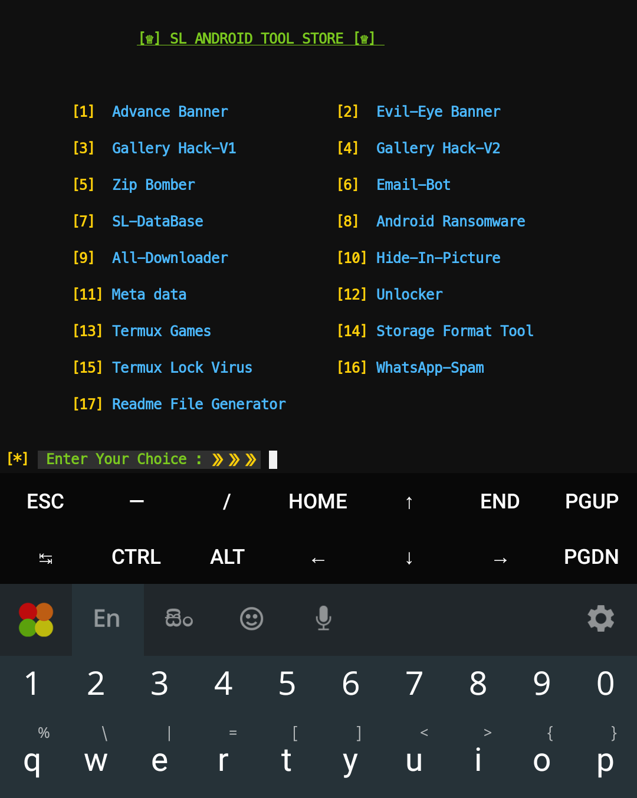

# SL-Tool-Store

 

 

* The biggest Collection of SL-Android's Termux Tools.You can run all tools without cloning one by one.

## INSTALLATION [Termux] [Linux] :

* `apt-get update -y`
* `apt-get upgrade -y`
* `apt install python -y`
* `git clone https://github.com/RazorKenway/SL-Tool-Store.git`
* `cd SL-Tool-Store`
* `python store.py`

## INSTRUCTION FOR USERS
    
    (1) First make sure your All packages are updated.
        
    (2) Install the All packages provided by the developer correctly.
        
    (3) Then install the requirements provided by the developer.

    (4) Finally Run python file (store.py)

         
